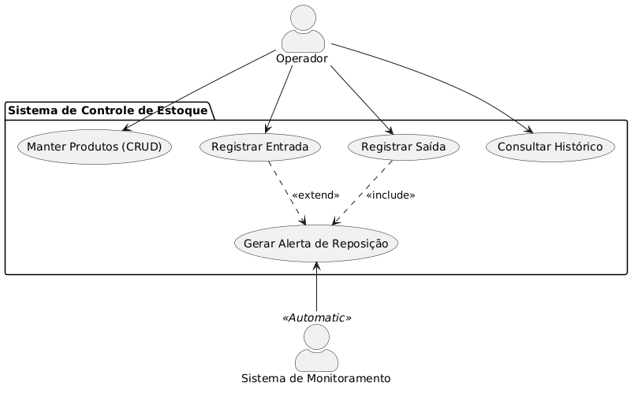
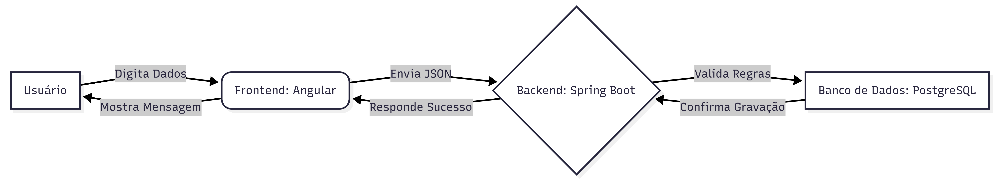
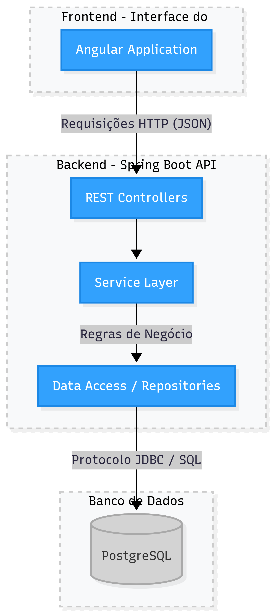
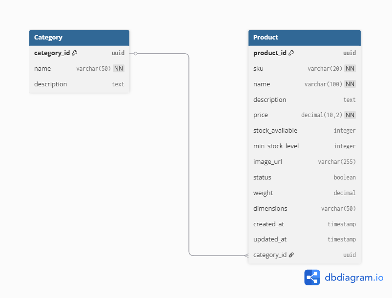
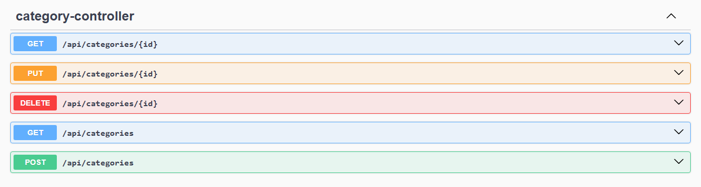
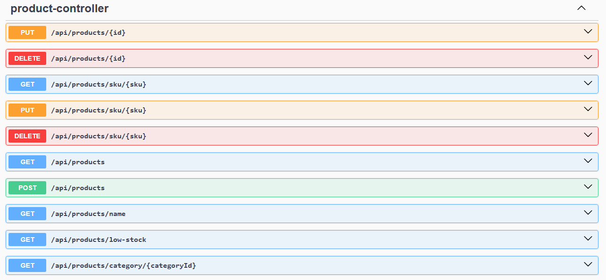

# 📦 Sistema de Gestão de Estoque - API (Back-end)
Este projeto é uma API robusta desenvolvida para o gerenciamento de produtos e controle de movimentação de estoque.

## 🏗️ Engenharia de Software e Design

### **Diagrama de Casos de Uso (UML):** 
Mapeamento das interações críticas (Reposição, Alerta de Estoque e CRUD), desenvolvido via PlantUML.

### **Fluxograma de Dados:** 
Visualização da transição da informação, do Controller até a persistência, desenhado em Mermaid Live.

### **Arquitetura do Sistema:** 
O sistema segue uma Arquitetura Monolítica baseada em camadas, garantindo a separação de responsabilidades. O diagrama abaixo foi construído utilizando Mermaid Live.

### **Modelo Lógico do Banco de Dados:** 
Estrutura de dados projetada via dbdiagram.io para garantir relacionamentos eficientes entre Categorias e Produtos.

## 🚀 Tecnologias Utilizadas

### Core
- **Java 17** & **Spring Boot 3**
- **Spring Data JPA**: Abstração de persistência e consultas dinâmicas.
- **Spring Validation**: Validação de dados na entrada da API.
- **PostgreSQL**: Banco de dados relacional de alta performance.

### Produtividade e Documentação
- **Lombok**: Redução de código boilerplate.
- **SpringDoc OpenAPI (Swagger)**: Documentação interativa da API.
- **Records (DTOs)**: Uso de Records para imutabilidade no tráfego de dados.
- **SLF4J/Logback**: Implementação de logs para rastreabilidade de estoque baixo.

## 🛠️ Funcionalidades Implementadas
- [x] **CRUD Completo:** Gerenciamento de Produtos e Categorias.
- [x] **Paginação e Ordenação:** Consultas otimizadas para grandes volumes de dados.
- [x] **Busca Customizada (JPQL):** Filtros específicos para produtos com estoque crítico.
- [x] **Tratamento de Exceções:** GlobalExceptionHandler para respostas padronizadas e amigáveis.
- [x] **CORS Configuration:** Ponte estabelecida para integração segura com o Frontend (Angular).

## 📖 Como Testar a API
1. Certifique-se de ter o **PostgreSQL** rodando localmente.
2. Clone o repositório e execute o projeto via IntelliJ ou terminal (`mvn spring-boot:run`).
3. Acesse a documentação interativa para testar os endpoints: http://localhost:8080/swagger-ui/index.html

## 📊 Visualização do Projeto
Abaixo, a interface do Swagger UI, que permite a exploração e o teste em tempo real dos endpoints da API. 

---
**Desenvolvido por [Mislaine Almeida](https://github.com/mislainealmeida)** 
